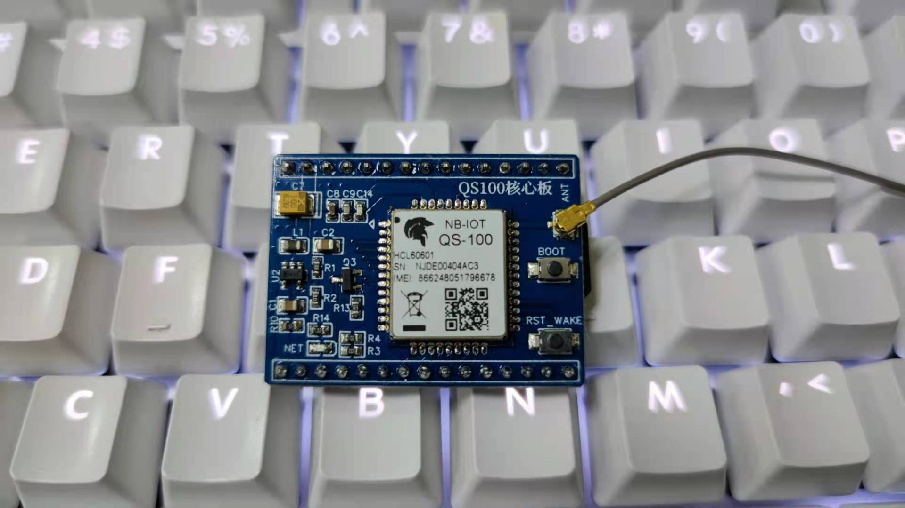

# [XY1100](https://github.com/SoCXin/XY1100)

* [xinyisemi](http://www.xinyisemi.com)：[Cortex-M3](https://github.com/SoCXin/Cortex)
* [L3R3](https://github.com/SoCXin/Level)：39.168MHz, [130MIPS](https://www.eembc.org/coremark/scores.php)

## [简介](https://github.com/SoCXin/XY1100/wiki)

[XY1100](https://github.com/SoCXin/XY1100) 首款集成CMOS PA的NB-IoT SoC芯片

### 关键特性

* 双核SoC
* 140K可用RAM,417K可用flash
* 灵敏度：< -134 dBm
* 输出功率：23 dBm ± 2 dB
* 690-960MHz，1.71-2.2GHz
* 900K RAM (140K)

### [资源收录](https://github.com/SoCXin)

* [参考资源](src/)
* [参考文档](docs/)
* [参考工程](project/)

### [选型建议](https://github.com/SoCXin)

[XY1100](http://www.xinyisemi.com/a/products/67.html) 具有竞争力的双核NB-IoT芯片，支持openCPU，如果有相关的开发能力，可以实现非常丰富的应用开发。

[XY1100](https://github.com/SoCXin/XY1100)芯片及相关模组的开源生态仍然处在萌芽阶段，目前最大的优势是硬件成本及集成度，openCPU可玩性并不高，相关竞品[EC616](https://github.com/SoCXin/EC616)具有更丰富的生态。

* QFN52(6x6mm)

#### 相关开发板

### [探索芯世界 www.SoC.xin](http://www.SoC.Xin)
